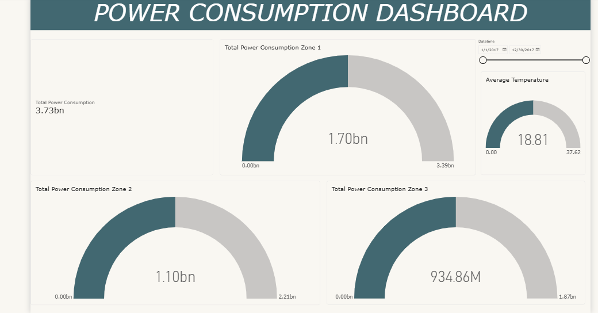

# Power Consumption Analysis

## Project Overview

This project analyses power consumption across three areas over a one-year period and examines patterns in power usage alongside average temperature.

## Objective

The objective of this project is to analyse power consumption over time, compare consumption across the three areas, and explore how average temperature relates to power usage.

## Tools Used

* Microsoft Excel
* Power BI

## Analysis

The data was cleaned and analysed using Excel before being visualised in Power BI. The analysis focuses on:

* Power consumption over the year
* Average temperature over the year
* Comparison of power consumption across the three areas
* Changes in consumption over time
* The relationship between temperature and power consumption

Research also supports examining temperature alongside electricity demand, as temperature can influence electricity consumption.

## Dashboard

The Power BI dashboard presents interactive visualisations showing power consumption patterns across the three areas and changes in average temperature over the year.

## Dashboard Preview

## Files

* `powerconsumption` — Excel dataset used for the analysis
* Power BI dashboard — Interactive dashboard containing the analysis

## Key Skills Demonstrated

* Data cleaning
* Data analysis
* Time-series analysis
* Excel
* Power BI
* Data visualisation
* Dashboard development

## Author

Baah Joseph Ayertey
